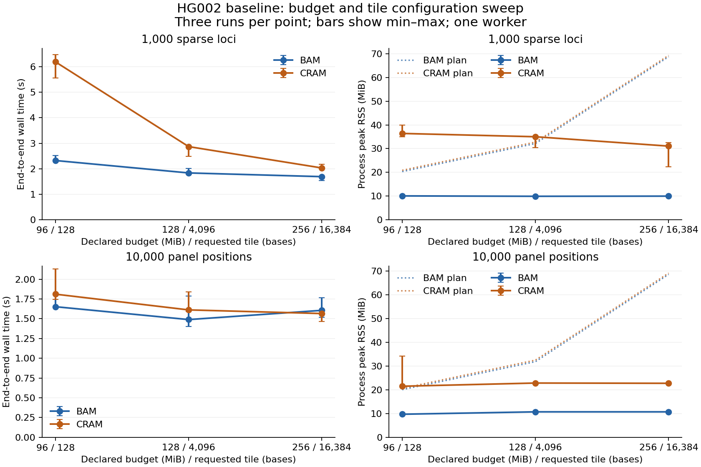

# Benchmarks and limitations

Published results identify exact inputs, package and harness hashes, commands,
platform, resource controls, outputs, and reproduction steps. A passing harness
or an implementation is not a performance result.

## Exact evidence

The [HG002 study](findings/representative-evidence-2026-09-06/README.md) retains 108
runs across chromosome-scale sparse selection and matched BAM/CRAM windows, with
three repetitions, several budget/tile configurations, 1/2/8 workers, cache resume,
and saved-dataset extraction. All emitted observations agreed with independent
pysam traversal; successful results were invariant in the tested configurations.

The post-run audit verified unchanged input, binary and harness identities and
measured RSS below every declared budget. **Eight CRAM predictions underestimated
RSS.** CRAM slice/codec allocations are not governed by the genomic tile alone;
the conservative decoder model is being corrected. Do not treat the baseline plan
as a universal allocation bound. The retained report shows the original mismatch
rather than replacing it with a later successful run.

Native wall time includes setup, source hashing, analysis, encoding and output
finalization. Separate verification time is reported. The pysam oracle extracts
aligned scientific observations but omits Rosalind's content-verification and
receipt work; its time is not an equal-trust end-to-end comparison. Phase timers
may overlap. No filesystem-cache eviction was performed; raw filesystem-operation
counters are not total bytes read.

Cache resume avoided alignment decoding but still rehashed original inputs.
Verified saved-dataset queries avoided original-source work and were faster in
these repeated small queries. Initial materialization, retained storage and
verification are included in the report. These measurements do not establish
whole-genome throughput or a general benefit from extra workers.

The earlier [NA18507 check](findings/evidence-engine-2026-09-05/README.md) is a tiny
real-origin semantic/repeatability test. The [physical projection study](findings/field-projection-2026-09-06/README.md)
uses synthetic pressure fixtures. Their scope is separate from HG002 and from
independent user evidence. The executable harnesses and their reproduction
instructions are in [benchmarks/evidence](../benchmarks/evidence/README.md).

## OS limits and failure behavior

The HG002 baseline also passed seven [Linux cgroup scenarios per encoding](findings/representative-evidence-2026-09-06/README.md#memory-finding-and-actual-linux-limits):
verified BAM/CRAM successes at 128 MiB, preflight refusal, cooperative resource
failure, a separate allocation control, and a native OOM case. Raw kernel events,
Docker state, limits, partial outputs and receipts are retained. Cgroup memory
includes charged file cache and differs from process RSS. The Linux environment
is a VM on the same physical host, not independent-machine adoption.

Cooperative memory observation and `--require-os-limit` checking an existing Linux
cgroup cap provide different assurance. Native libraries can allocate before a
record-envelope check, and downstream Python/R/SQL memory is outside the native
worker budget. [Scientific and execution semantics](SEMANTICS.md) defines the
supported contract and refusal behavior.

## Remaining comparisons and scope

High-depth capture panels, more CRAM codecs/layouts, whole-genome workloads, and
semantics-aligned bam-readcount/samtools/mosdepth comparisons remain open. Public
package installation and non-author task completion are tracked in
[implementation status](implementation-status.md), separately from authored tests.

The [legacy platform harness](../benchmarks/platform/) compares related feature
extraction in Rosalind, pysam and bcftools; only explicitly aligned fields and
filters support equality claims. The reference-construction comparison remains
separate from evidence extraction: the new analysis does not require an FM-index.

The experimental caller remains short-read, diploid and SNV-focused. Its
[GIAB baseline](../benchmarks/giab/) is not established; a working evaluator smoke
test is not caller accuracy evidence. Current evidence supports indexed BAM/CRAM,
physical field projection and bounded first-party worker scheduling. Legacy
region/shard APIs retain their own BAM/BAI constraints. UMI/fragment consensus,
indel/haplotype inference, production calling and Linux ARM wheels remain outside
the current contract.
